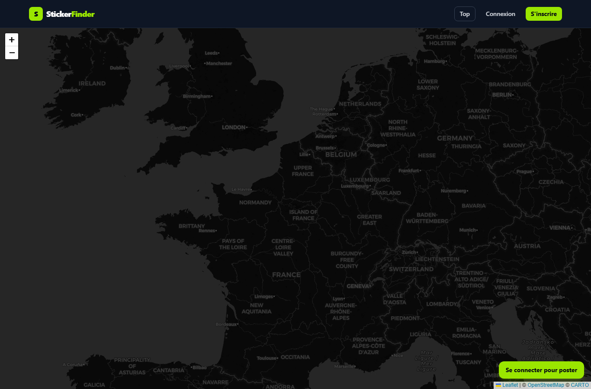
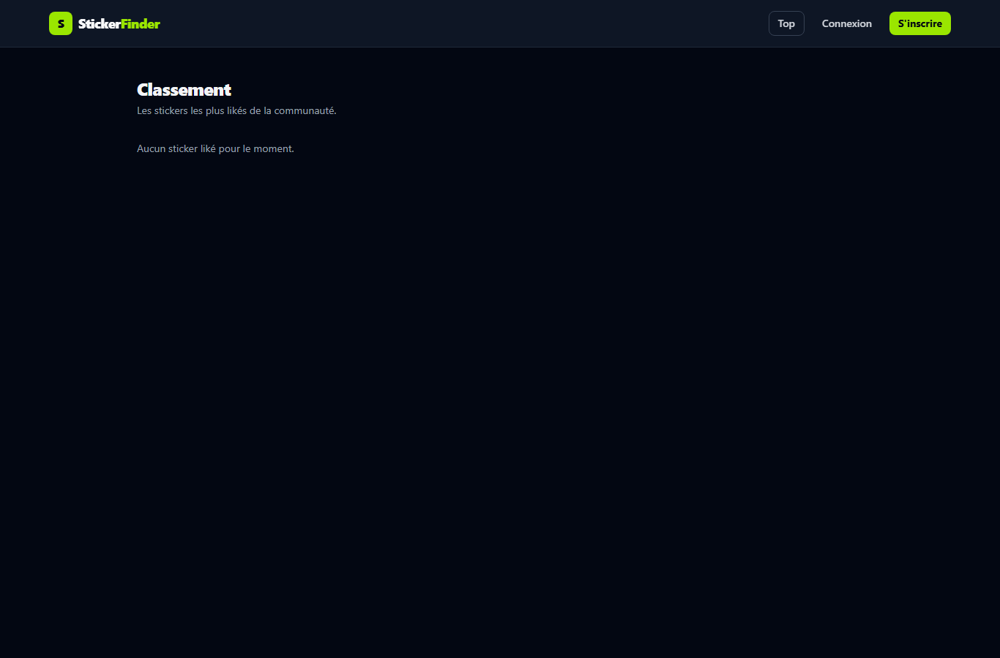
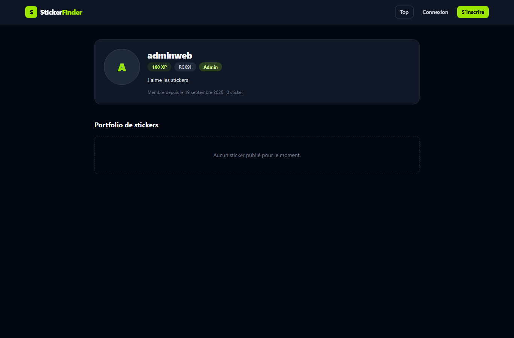
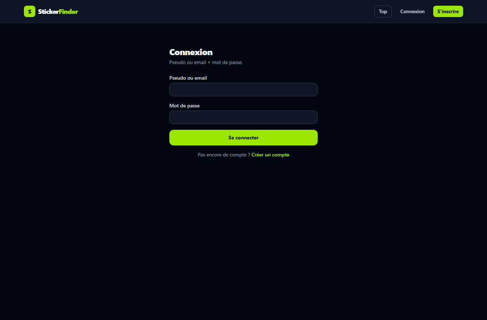
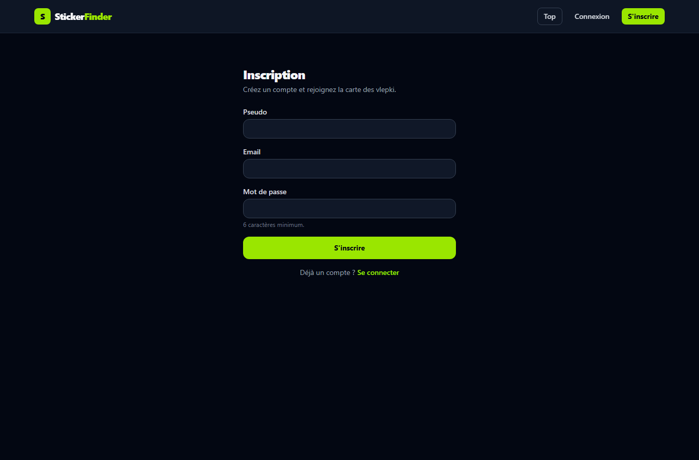

# Sticker Finder 🗺️

Réseau social + carte interactive pour collectionneurs de stickers d'**ultras**.
Chacun photographie un sticker collé dans la rue, le place sur la carte, gagne
de l'**XP**, like les trouvailles des autres et consulte les **portfolios** des
collectionneurs.

> Projet full-stack fonctionnel — front Vue 3 + Leaflet, back Express + MariaDB.

---

## ✨ Fonctionnalités

- **Carte interactive** (Leaflet, thème sombre) avec les stickers géolocalisés,
  popup au clic : photo, **description**, auteur cliquable, **nombre de likes**,
  bouton *Liker* (+10 XP à l'auteur), suppression (propriétaire ou admin).
- **Ajout d'un sticker** : upload photo (jpg/png/webp, 10 Mo max), description,
  emplacement choisi **au clic sur la carte** (marqueur déplaçable) ou via GPS.
- **Système de comptes** : inscription/connexion (JWT), pseudo ou email,
  profil public (`/user/:pseudo`) : avatar, XP, équipe, **bio**, badge admin et
  **portfolio** de stickers.
- **Paramètres** (`/settings`) : photo de profil, équipe, bio, **clé API**
  (régénérable), **suppression du compte**.
- **Classement** (`/top`) : les stickers les plus likés ; un clic ramène sur la
  carte à la **localisation exacte** de la photo (portfolio inclus).
- **Administration** (`/admin`) : recherche de comptes, promotion/rétrogradation
  admin, suppression d'un compte (stickers + fichiers inclus), suppression de
  n'importe quel sticker.
- **Bascules automatiques** entre fournisseurs de tuiles si les tuiles sont
  bloquées, clé API CARTO optionnelle (supprime le filigrane).

## 🧱 Stack technique

| Côté     | Technologie |
| -------- | ----------- |
| Back     | Node.js, Express 5, JWT (`jsonwebtoken`), `bcrypt`, `multer` |
| Base     | MariaDB (`mysql2`), schéma dans `sql/schema.sql` |
| Front    | Vue 3 (`<script setup>`), Vue Router, Pinia, Axios |
| Cartes   | Leaflet 1.9 + tuiles CARTO (Dark Matter) / OSM |
| Styles   | Tailwind CSS 4 (thème sombre) |
| Outils   | Vite 8 (proxy `/api` → `:3000`), nodemon |

## 📁 Structure du projet

```
.
├─ server.js                     # démarrage (vérifie la DB puis écoute)
├─ app.js                        # montage des middlewares + routes
├─ config/db.js                  # pool MySQL/MariaDB
├─ controllers/                  # logique (auth, user, sticker, like, admin)
├─ middleware/                   # JWT, admin, upload, erreurs
├─ routes/                       # auth, users, stickers, likes, admin
├─ scripts/make-admin.js         # promotion d'un compte au rôle admin
├─ sql/schema.sql                # création DB + tables (users, stickers, likes)
├─ public/uploads/               # photos uploadées (sticker + avatars)
└─ frontend/
   ├─ .env.example               # VITE_CARTO_API_KEY (tuiles sans filigrane)
   └─ src/
      ├─ views/                  # Carte, Top, Profil, Paramètres, Admin, Auth
      ├─ components/             # Navbar, VlepkiMap, AddSticker
      ├─ stores/auth.js          # session (token + user + rôle)
      ├─ router/index.js         # routes + gardes (connexion / admin)
      └─ services/               # client Axios, fournisseurs de tuiles
```

## ⚙️ Prérequis

- Node.js ≥ 20
- MariaDB ≥ 10.5 (service lancé, accessible en TCP :3306)

## 🚀 Installation

**1. Frapper le schéma de base (création des tables)**

```bash
mysql -u root -p < sql/schema.sql
```

**2. Back-end — configuration**

```bash
npm install
cp .env.example .env    # puis éditer
```

`.env` (back) :

```env
PORT=3000
NODE_ENV=development
DB_HOST=localhost
DB_PORT=3306
DB_USER=root
DB_PASSWORD=
DB_NAME=sticker_finder
JWT_SECRET=change-moi-par-une-longue-chaine-aleatoire-de-plus-de-32-caracteres
JWT_EXPIRES_IN=7d
```

**3. Front-end — configuration**

```bash
cd frontend
npm install
cp .env.example .env    # puis ajouter sa clé (optionnel)
```

`frontend/.env` :

```env
VITE_CARTO_API_KEY=     # clé gratuite : https://carto.com/basemaps/apikey
```

> Sans clé, les tuiles CARTO restent utilisables mais couvertes d'un filigrane
> « API key required ». Choisissez `frontend/.env`, puis **redémarrez Vite**.

**4. Lancer les deux serveurs** (deux terminaux)

```bash
npm run dev          # racine  → API Express http://localhost:3000
cd frontend
npm run dev          #         → app http://localhost:5173
```

Le front (Vite) proxye `/api` et `/uploads` vers le back. Ouvrez
**http://localhost:5173**.

> Migration base existante : si vous ajoutez des colonnes au schéma après coup,
> exécutez les `ALTER TABLE` correspondants (ex. `ADD COLUMN bio VARCHAR(300) DEFAULT NULL`).

## 👑 Comptes & rôles

Tout nouveau compte est un simple **utilisateur**. Pour promouvoir un compte au
rôle **admin** :

```bash
npm run make-admin -- <pseudo|email>
```

Exemple :

```bash
npm run make-admin -- adminweb
```

Puis reconnectez-vous : le lien **Admin** apparaît dans la barre de navigation.

Un admin peut aussi être créé en SQL :

```sql
UPDATE users SET role = 'admin' WHERE pseudo = 'monpseudo';
```

---

## 🔌 API REST

Préfixe : `http://localhost:3000`. Les routes protégées attendent
`Authorization: Bearer <token>`.

### Auth & comptes
| Méthode | Route | Description |
| ------- | ----- | ----------- |
| POST | `/api/auth/register` | Inscription (`pseudo`, `email`, `password`) → token |
| POST | `/api/auth/login` | Connexion (`identifier` = pseudo ou email, `password`) |
| GET | `/api/auth/me` | Profil de l'utilisateur connecté (JWT) |
| GET | `/api/users/:pseudo` | Profil public + stickers (portfolio) |
| PATCH | `/api/users/me` | Update `team`, `bio`, `avatar` (multipart, JWT) |
| POST | `/api/users/me/api-key` | Régénère la clé API (JWT) |
| DELETE | `/api/users/me` | Supprime son compte (JWT) |

### Stickers & likes
| Méthode | Route | Description |
| ------- | ----- | ----------- |
| GET | `/api/stickers` | Flux des stickers (avec nombre de likes) |
| GET | `/api/stickers/top?limit=20` | Classement par likes décroissants |
| POST | `/api/stickers` | Ajout (multipart : `image`, `lat`, `lng`, `description`, JWT) |
| DELETE | `/api/stickers/:id` | Suppression (propriétaire ou admin, JWT) |
| POST | `/api/stickers/:id/like` | Like (+10 XP à l'auteur, JWT) |

### Administration (JWT + rôle admin)
| Méthode | Route | Description |
| ------- | ----- | ----------- |
| GET | `/api/admin/users` | Liste des comptes (avec stats) |
| PATCH | `/api/admin/users/:id/role` | Promouvoir / rétrograder (`role` : `user`/`admin`) |
| DELETE | `/api/admin/users/:id` | Supprime le compte + stickers + fichiers |
| DELETE | `/api/admin/stickers/:id` | Supprime n'importe quel sticker |

Utilitaires : `GET /api/health` (check de l'API).

## 💻 Mode de test / vérification manuelle

Environnement de test utilisé : account `adminweb`, un sticker géolocalisé
(Paris) avec 1 like. Parcours de vérification :

1. **Carte** : ouvrir `/` → les tuiles se chargent, le/les marker(s) apparaissent.
2. **Popup** : cliquer un marker → photo, description lisible (texte clair sur
   fond sombre), auteur cliquable, compteur de likes.
3. **Connexion** : `/login` avec un compte → bouton *+ Sticker* et *Paramètres*
   disponibles.
4. **Portfolio** : `/user/:pseudo` → avatar, XP, bio, portfolio ; clic sur une
   photo → la carte s'ouvre **sur la localisation exacte** (popup ouverte).
5. **Classement** : `/top` → stickers triés par likes ; clic → carte centrée.
6. **Admin** : `/admin` → recherche, promotion/rétrogradation, suppression.
7. **Suppression** : le propriétaire ou un admin peut supprimer un sticker depuis
   sa popup ; `/settings` permet de supprimer son compte.

## 📸 Captures d'écran

Captures réelles (app en cours d'exécution, thème sombre) :

| Écran | Aperçu |
| ----- | ------ |
| Carte principale avec popup |  |
| Classement TOP |  |
| Profil public + portfolio |  |
| Connexion |  |
| Inscription |  |

## 📦 Déploiement (notes)

- Back : `npm start` (ou `npm run dev` en dev, nodemon).
- Front : `cd frontend && npm run build` → dossier `dist/` (à servir par le
  serveur statique de votre choix ; Vite proxy uniquement en dev).
- Renseignez `VITE_CARTO_API_KEY` au moment du build pour inclure la clé dans
  les tuiles.

## 📄 Licence

MIT.